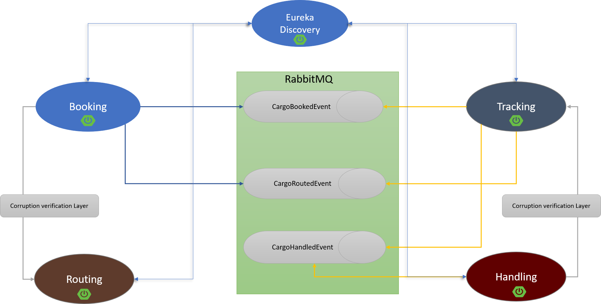

# cargo-tracker

The application is implemented as DDD implementation using Spring Boot
The implementation is a microservices based architecture using the below technologies:
- Spring Boot
- Spring Cloud streams for microservices choreography infrastructure
- RabbitMQ as message broker
- Spring Data for data management
- Eureka Server as Discovery service

##Architecture highlight 

## How to import
> #####Import as either gradle project or Intellij Project "From Existing Sources"
## How to setup
- Get a running instance from mysql (either local installation - VM or docker )
    - for docker instance you can
    
            docker run -d --name cargo_db -p 3306:3306 -e MYSQL_ROOT_PASSWORD=root mysql:latest
      
    - in that case you need to create user for each microservice
- Get a running instance of RabbitMQ ...you can also have a docker container running

        docker run -d --hostname localhost --name my-tracker -p 15672:15672 -p 5672:5672 -p 15692:15692 rabbitmq:3-management
    
- Create required exchange of type topic and bind it to the queue with a routing key to avoid any confusion, routing
  keys exist in [common.properties](config/common.properties)
- To update the common configurations related to URLS,usernames and passwords you can
  update [common.properties](config/common.properties) this file is copied to all projects resources directory before
  compileJava

### RabbitMQ configurations:

> Exchange (tracker.booking) -> Queue (tracker.bookingqueue)
>
> Exchange (tracker.routing) -> Queue (tracker.routingqueue)
>
> Exchange (tracker.handling) -> Queue (tracker.handlingqueue)

This Arrow refers to binding configuration

### Components running

> There is no running dependency between services but functionality-wise service-discovery should be started first and booking service requires routing service to assign route

### Functional/Integration Test

Actually for now only integration test of both booking and handling services is partially implemented The required test
infrastructure is there and running, what comes next is some extra coding

- ### Setup each Microservice separately
  #### [Booking](booking/README.md)
  #### [Handling](handling/README.md)
  #### [Routing](routing/README.md)
  #### [Tracking](tracking/README.md)
  #### [Service Discovery](service-discovery/README.md)
